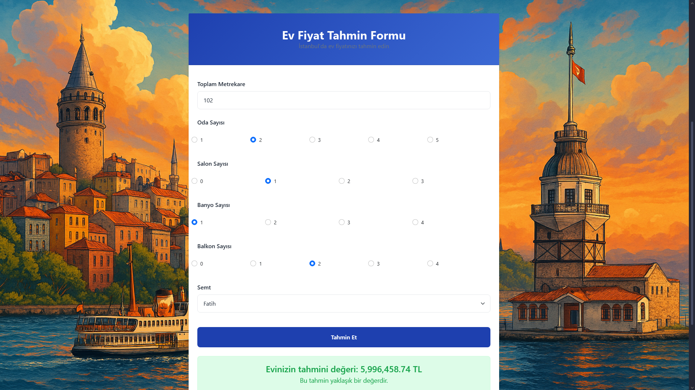

# Istanbul Housing Price Prediction 2026 / İstanbul Konut Fiyat Tahmini 2026




## Kendi oluşturduğum özel bir veri seti ile, İstanbul’daki konut fiyatlarını çeşitli özelliklere göre tahmin eden bir makine öğrenmesi modeli geliştiriyorum. Proje kullanıcı dostu bir arayüz de içermektedir. With a custom dataset I created, I’m developing a machine learning model to predict housing prices in Istanbul based on various features. The project also include a user-friendly interface.
## Yalnızca bir satırlık katkınız bile olsa paylaşmaktan çekinmeyin, çünkü bu projeyi birlikte daha iyi hâle getirebiliriz. İsterseniz bu projeyi kendi GitHub hesabınıza kopyalayarak (fork) üzerinde çalışabilir, yaptığınız geliştirmeleri bana geri iletmek için değişiklik önerisi (pull request) gönderebilirsiniz. Even a single line of contribution is welcome — together, we can make this project even better. You can copy this project to your own GitHub (fork), make improvements, and send me your changes through a pull request.
## Dataset bu repoda yer almakta ve örnek notebook’lar doğrudan bu dosya ile çalışmaktadır. The dataset is included in this repository, and sample notebooks directly reference it for seamless access.

## Uygulamayı başlatmak için aşağıdaki komutu kullanabilirsiniz (Docker Engine'in çalıştığından emin olun). Run the following command to start the application (Make sure Docker Engine is running).
```bash
docker-compose up --build
```

